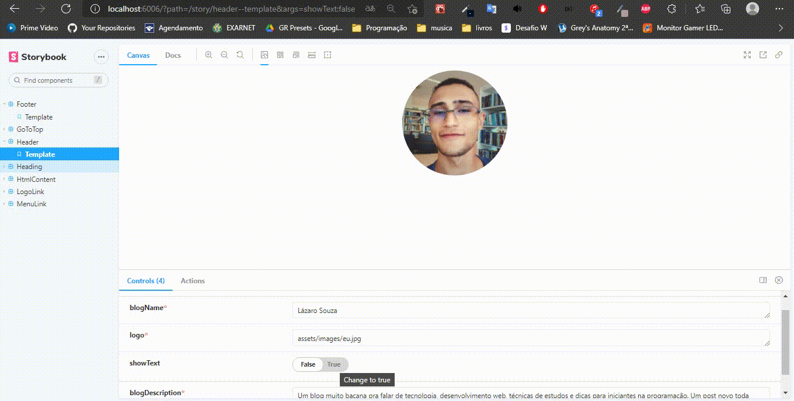
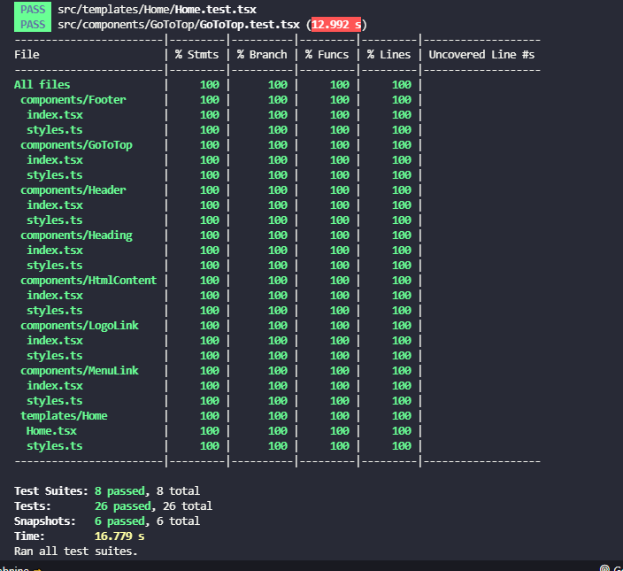

<h1 align=center>
🚧 In construction 🚧
</h1>

<h1 align=center>
 Take a Coffee ☕
</h1>

<span align=center>
  
[](https://open.spotify.com/collection/tracks)
  
</span>
<br>
<hr>

## About 🕵️
This is a ambicious blog project started as a course final skills training. I had the amazing idea to rebuild the original Strapi CMS / GraphQL data provider to a Golang / REST approach, using all my skills from the last two years of corporative contribution.

### Commits 📦

I've been followed the [conventinal commits](https://www.conventionalcommits.org/en/v1.0.0/#specification) to organize my code, feel free to learn more about it.

<br>
<h2 id="tecnologias">
 Tec's ⤵️
</h2>

| Front-end                                           | Description                                                      |
| --------------------------------------------------- | ---------------------------------------------------------------- |
| [React.js](https://pt-br.reactjs.org/)              | The master of web development market share                       |
| [Next.js](https://nextjs.org/)                      | To use SSG ,SSR, ISR                                             |
| [TypeScript](https://www.typescriptlang.org/)       | The superset of Javascript. Provide us a robust  type system     |
| [StoryBook](https://storybook.js.org/)              | UI documentation for front-end components                        |
| [Jest](https://jestjs.io/pt-BR/)                    | Unit and 2E2 tests of our front-end app                          |
| [Styled Components](https://styled-components.com/) | Runtime stylesheet solution to suport SCSS and SASS              |

<br>

| Back-End                                       | Description                                                                              |
| ---------------------------------------------- | ---------------------------------------------------------------------------------------- |
| [Golang](https://go.dev/doc/)                  | Simple and efficient, how to now fall in love with Golang?                               |
| [MongoDB](https://www.mongodb.com/cloud/atlas) | One of the best no-sql databases available                                               |
| [Cloudnary](https://cloudinary.com/)           | A service that provide to us the CDN application to save our images                      |

<hr>
<br>

<h2 id="executar">
 Steps for local execution 🔴
</h2>

### Front-end

1. Clone
`git clone https://github.com/lazarok09/next-blog.git`
2. Go to the directory
`cd ./frontend`

4. Install dependecies
 `npm i`

5.  Run dev envrioment
`npm run dev`

### Backend
1. Go to the folder
`cd ./backend`
2. [Install golang at your machine at](https://go.dev/doc/install)
4. Run the follow command:
`go install`
`go run main.go`

## Enviroments 👾

#### StoryBook 

The storybook documentation consist in a set of components that are fullfilled with data mocks in a way that we can see how actually components were created and are binded together to form the web app.

```
npm run storybook
```

<span align=center>
    
## Storybook component demonstration

</span>

<div align=center>
    

    
</div>

<hr>


### Test (Jest)

Our front-end enviroment can be tested with the follow commands:

```
npm run test --watchAll --silent
```

```
npm run test -- --watchAll=false --coverage
```

<span align=center>
    
## Test demonstration

</span>


<div align=center>
    

    
</div>

<hr>


## MongoDB

To connect to the mongodb using shell, please provide the username/password of the application.

```
mongosh "mongodb+srv://cluster0.9bo4v.mongodb.net/" --apiVersion 1 --username <username>
```

And start your first queries by using commands such as

```
show dbs
use <db>

show collections

db.<collection>

```

Docs available at:

1.📘 https://www.mongodb.com/docs/mongodb-shell/run-commands/

2.📘 https://www.mongodb.com/docs/v3.4/reference/mongo-shell/#command-line-options


<span align=center>

# < 👨‍💻 />
    
</span>
